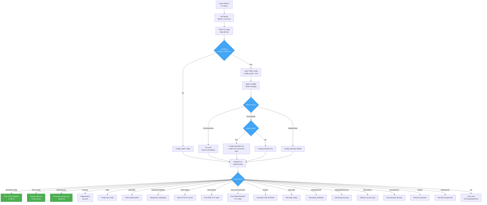
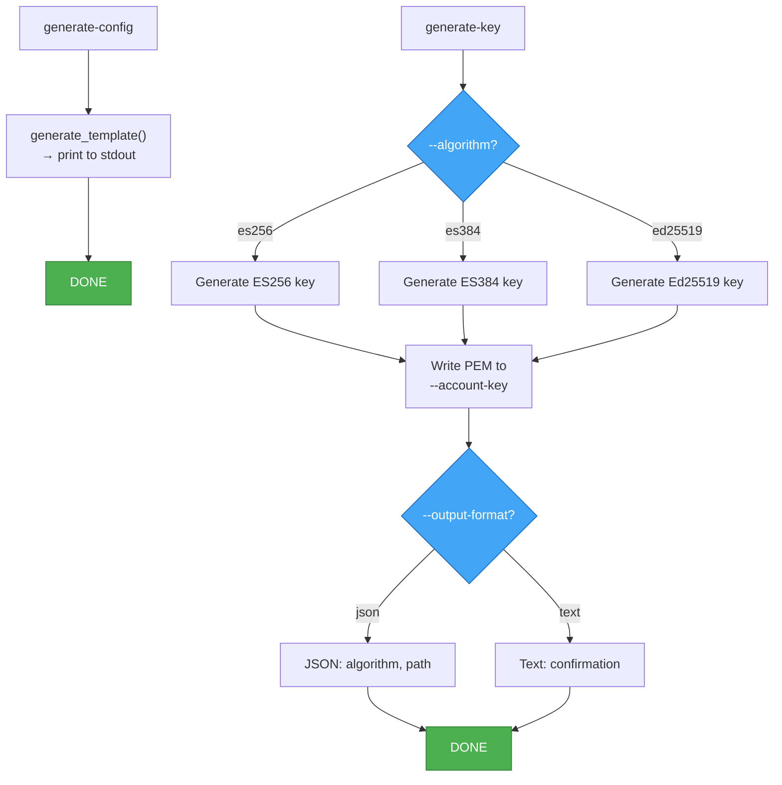
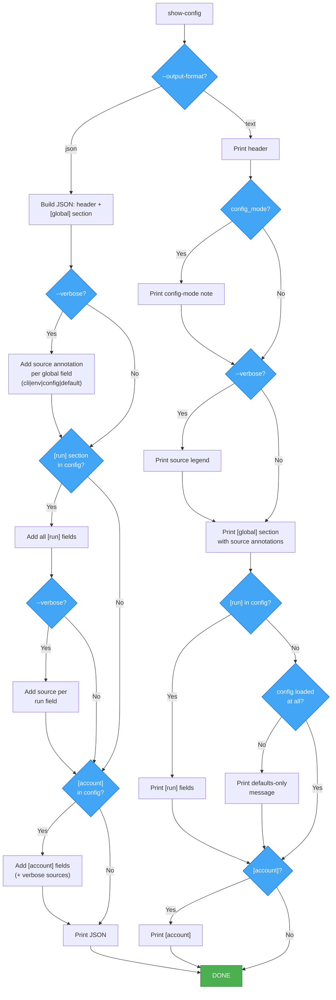
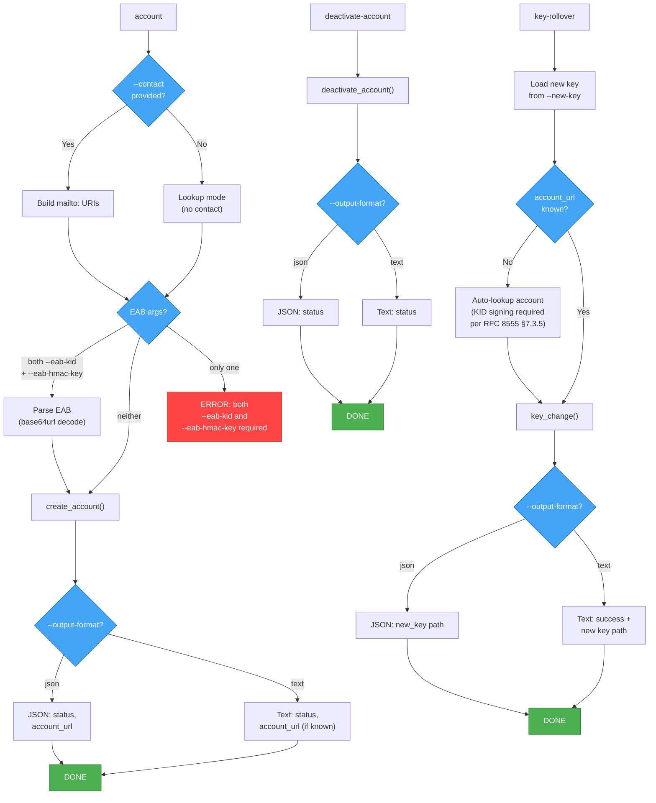
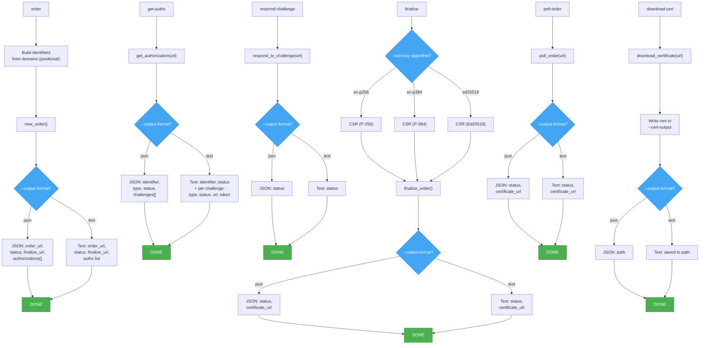
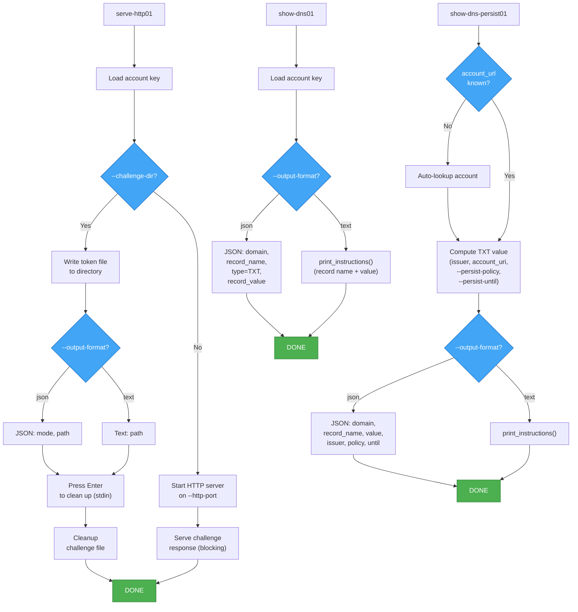
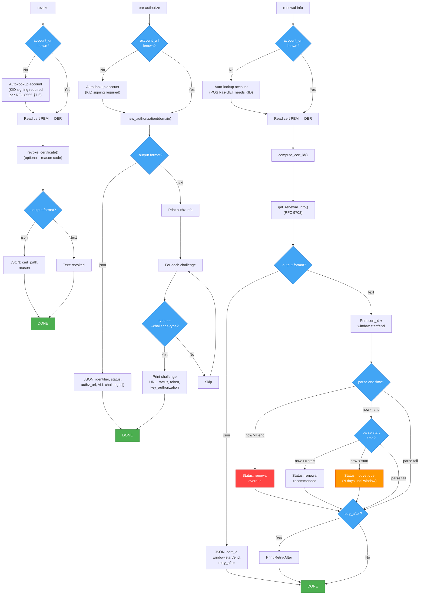

# Parameter Processing Decision Tree

---

## Subcommand Detail Flows

### run (Full Automated Flow)

```mermaid
graph TD
    RUN["run"] --> VALIDATE_DOMAINS{"domains<br/>provided?"}
    VALIDATE_DOMAINS -- No --> BAIL_DOMAIN["ERROR: at least one<br/>domain required"]
    VALIDATE_DOMAINS -- Yes --> CERT_EXISTS{"cert file<br/>exists?"}

    %% Renewal checks (only if cert exists)
    CERT_EXISTS -- No --> ACCT_STEP
    CERT_EXISTS -- Yes --> SAN_CHECK{"SANs match<br/>requested domains?"}

    %% Domain mismatch check (before ARI/days)
    SAN_CHECK -- Yes --> ARI_CHECK
    SAN_CHECK -- "parse failed" --> ARI_CHECK
    SAN_CHECK -- "No (mismatch)" --> REISSUE_FLAG{"--reissue-on-mismatch?"}
    REISSUE_FLAG -- Yes --> ACCT_STEP_REISSUE["Proceed to reissue<br/>(skip ARI/days,<br/>no replaceOrder)"]
    REISSUE_FLAG -- No --> SKIP_MISMATCH["SKIP: domain mismatch<br/>(use --reissue-on-mismatch)"]
    ACCT_STEP_REISSUE --> ACCT_STEP

    ARI_CHECK{"--ari flag?"}

    ARI_CHECK -- Yes --> ARI_QUERY["Query ACME server<br/>renewal info (RFC 9702)"]
    ARI_QUERY --> ARI_RESULT{"ARI result?"}
    ARI_RESULT -- "NOW < window.start" --> SKIP_ARI["SKIP: not yet<br/>in renewal window"]
    ARI_RESULT -- "window open" --> ARI_COMPUTE{"compute_cert_id<br/>succeeds?"}
    ARI_COMPUTE -- Yes --> ARI_SET_ID["Set ari_cert_id<br/>for replaceOrder"]
    ARI_SET_ID --> ACCT_STEP
    ARI_COMPUTE -- No --> DAYS_CHECK
    ARI_RESULT -- "ARI failed/unsupported" --> DAYS_CHECK
    ARI_CHECK -- No --> DAYS_CHECK

    %% Days-based renewal (only if ARI didn't set cert_id)
    DAYS_CHECK{"--days N?"}
    DAYS_CHECK -- Yes --> DAYS_LEFT{"remaining ><br/>threshold?"}
    DAYS_LEFT -- Yes --> SKIP_DAYS["SKIP: cert still<br/>has >N days"]
    DAYS_LEFT -- No --> ACCT_STEP
    DAYS_CHECK -- No --> ACCT_STEP

    %% Account + Pre-authorization
    ACCT_STEP["Step 1: Create/find<br/>account"] --> PREAUTH_CHECK{"--pre-authorize?"}
    PREAUTH_CHECK -- Yes --> PRE_AUTH["Step 2: Pre-authorize<br/>each domain (sequential)"]
    PRE_AUTH --> PRE_CH_TYPE{"challenge<br/>type?"}
    PRE_CH_TYPE -- http-01 --> PRE_HTTP["Setup HTTP-01<br/>(server or dir)"]
    PRE_CH_TYPE -- dns-01 --> PRE_DNS["Setup DNS-01<br/>(hook or manual)"]
    PRE_CH_TYPE -- dns-persist-01 --> PRE_DNSP["Setup DNS-PERSIST-01"]
    PRE_CH_TYPE -- tls-alpn-01 --> PRE_TLS["Setup TLS-ALPN-01<br/>(manual)"]
    PRE_HTTP --> NEW_ORDER
    PRE_DNS --> NEW_ORDER
    PRE_DNSP --> NEW_ORDER
    PRE_TLS --> NEW_ORDER
    PREAUTH_CHECK -- No --> NEW_ORDER

    %% Create order
    NEW_ORDER{"ari_cert_id<br/>available?"}
    NEW_ORDER -- Yes --> REPLACE_ORD["new_order_replacing()<br/>(RFC 9702)"]
    NEW_ORDER -- No --> NORMAL_ORD["new_order()"]
    REPLACE_ORD --> AUTHZ_MODE
    NORMAL_ORD --> AUTHZ_MODE

    %% Parallel vs Sequential
    AUTHZ_MODE{"--dns-hook +<br/>(dns-01 | dns-persist-01)?"}
    AUTHZ_MODE -- Yes --> PARALLEL["PHASED PARALLEL<br/>DNS Authorization"]
    AUTHZ_MODE -- No --> SEQUENTIAL["SEQUENTIAL<br/>Authorization"]

    %% ===== PARALLEL DNS PATH =====
    PARALLEL --> P1["Phase 1: Fetch all authz<br/>+ create ALL TXT records<br/>(dns-hook create)"]
    P1 --> P2_CHECK{"--dns-wait?"}
    P2_CHECK -- Yes --> P2["Phase 2: Parallel DNS<br/>propagation wait<br/>(semaphore, concurrency=5)"]
    P2 --> P3
    P2_CHECK -- No --> P3
    P3["Phase 3: on-challenge-ready<br/>hooks + respond (serial)"]
    P3 --> P4["Phase 4: Poll all authz<br/>until valid"]
    P4 --> P5["Phase 5: Cleanup ALL<br/>DNS records (dns-hook cleanup)"]
    P5 --> GEN_CSR

    %% ===== SEQUENTIAL PATH =====
    SEQUENTIAL --> SEQ_LOOP["For each authorization"]
    SEQ_LOOP --> CH_TYPE{"challenge<br/>type?"}

    %% HTTP-01 (no on_challenge_ready hook, goes straight to respond)
    CH_TYPE -- http-01 --> HTTP_MODE{"--challenge-dir?"}
    HTTP_MODE -- Yes --> FILE_MODE["Write token file<br/>to directory"]
    HTTP_MODE -- No --> SERVER_MODE["Bind TCP server<br/>on --http-port"]
    FILE_MODE --> RESPOND
    SERVER_MODE --> RESPOND

    %% DNS-01 (sequential = no dns-hook, always manual)
    CH_TYPE -- dns-01 --> DNS_IP{"IP identifier?"}
    DNS_IP -- Yes --> BAIL_IP["ERROR: dns-01 not<br/>supported for IPs"]
    DNS_IP -- No --> DNS_PRINT["Print TXT record<br/>instructions"]
    DNS_PRINT --> DNS_WAIT_SEQ{"--dns-wait?"}
    DNS_WAIT_SEQ -- Yes --> POLL_DNS_SEQ["Poll DNS TXT<br/>every 5s until timeout"]
    DNS_WAIT_SEQ -- No --> ENTER_DNS["Press Enter<br/>to continue"]
    POLL_DNS_SEQ --> ON_CH_READY
    ENTER_DNS --> ON_CH_READY

    %% DNS-PERSIST-01 (sequential = no dns-hook, always manual)
    CH_TYPE -- dns-persist-01 --> DNSP_IP{"IP identifier?"}
    DNSP_IP -- Yes --> BAIL_IP2["ERROR: not supported<br/>for IPs"]
    DNSP_IP -- No --> DNSP_VALID{"issuer-domain-names<br/>1-10 entries?"}
    DNSP_VALID -- No --> BAIL_IDN["ERROR: malformed<br/>dns-persist-01"]
    DNSP_VALID -- Yes --> DNSP_PRINT["Print TXT record<br/>instructions"]
    DNSP_PRINT --> DNSP_WAIT_SEQ{"--dns-wait?"}
    DNSP_WAIT_SEQ -- Yes --> DNSP_POLL_SEQ["Poll DNS TXT<br/>every 5s until timeout"]
    DNSP_WAIT_SEQ -- No --> ENTER_DNSP["Press Enter<br/>to continue"]
    DNSP_POLL_SEQ --> ON_CH_READY
    ENTER_DNSP --> ON_CH_READY

    %% TLS-ALPN-01
    CH_TYPE -- tls-alpn-01 --> TLS_PRINT["Print instructions"]
    TLS_PRINT --> ENTER_TLS["Press Enter<br/>to continue"]
    ENTER_TLS --> ON_CH_READY_TLS{"--on-challenge-ready<br/>hook?"}
    ON_CH_READY_TLS -- Yes --> RUN_HOOK_TLS["Run hook<br/>(ACME_DOMAIN, ACME_TOKEN,<br/>ACME_KEY_AUTH)"]
    ON_CH_READY_TLS -- No --> RESPOND
    RUN_HOOK_TLS --> RESPOND

    %% on-challenge-ready (DNS types only in sequential path)
    ON_CH_READY{"--on-challenge-ready<br/>hook?"}
    ON_CH_READY -- Yes --> RUN_HOOK["Run hook script<br/>(env vars per type)"]
    ON_CH_READY -- No --> RESPOND
    RUN_HOOK --> RESPOND

    RESPOND["respond_to_challenge()"] --> POLL_AUTH["Poll authorization<br/>until valid/invalid"]
    POLL_AUTH --> TERM_CHECK{"is_challenge_terminal()?<br/>(status == Invalid)"}
    TERM_CHECK -- Yes --> FAIL_AUTH["ERROR: challenge<br/>failed (Invalid)"]
    TERM_CHECK -- "No (Pending+error)" --> POLL_AUTH
    POLL_AUTH -- Valid --> CLEANUP_SEQ["Cleanup<br/>(file / server abort)"]
    CLEANUP_SEQ --> SEQ_LOOP
    SEQ_LOOP -- "All done" --> GEN_CSR

    %% CSR & Finalize
    GEN_CSR["Generate CSR<br/>--cert-key-algorithm"] --> CSR_ALG{"algorithm?"}
    CSR_ALG -- ec-p256 --> EC256["ECDSA P-256"]
    CSR_ALG -- ec-p384 --> EC384["ECDSA P-384"]
    CSR_ALG -- ed25519 --> ED25519["Ed25519"]
    EC256 --> FINALIZE
    EC384 --> FINALIZE
    ED25519 --> FINALIZE

    FINALIZE["finalize_order()<br/>Submit CSR"] --> POLL_FIN["Poll order until<br/>certificate URL ready"]
    POLL_FIN --> DOWNLOAD["Download certificate"]

    %% Save key first, then cert (matches code order)
    DOWNLOAD --> KEY_ENC{"--key-password or<br/>--key-password-file?"}
    KEY_ENC -- Yes --> ENCRYPT["Encrypt private key<br/>(scrypt + AES-256-CBC)"]
    KEY_ENC -- No --> SAVE_RAW["Save key unencrypted"]
    ENCRYPT --> SAVE_KEY["Save key to<br/>--key-output"]
    SAVE_RAW --> SAVE_KEY
    SAVE_KEY --> SAVE_CERT["Save cert to<br/>--cert-output"]

    %% Post-issue hook
    SAVE_CERT --> CERT_HOOK{"--on-cert-issued<br/>hook?"}
    CERT_HOOK -- Yes --> RUN_CERT_HOOK["Run hook<br/>(ACME_DOMAINS, ACME_CERT_PATH,<br/>ACME_KEY_PATH, ACME_KEY_ENCRYPTED)"]
    CERT_HOOK -- No --> DONE["SUCCESS"]
    RUN_CERT_HOOK --> DONE

    %% Styling
    classDef error fill:#f44,color:white,stroke:#d32f2f
    classDef skip fill:#ff9800,color:white,stroke:#e65100
    classDef success fill:#4caf50,color:white,stroke:#2e7d32
    classDef decision fill:#42a5f5,color:white,stroke:#1565c0

    class BAIL_DOMAIN,BAIL_IP,BAIL_IP2,BAIL_IDN,FAIL_AUTH error
    class SKIP_ARI,SKIP_DAYS,SKIP_MISMATCH skip
    class DONE success
    class VALIDATE_DOMAINS,CERT_EXISTS,SAN_CHECK,REISSUE_FLAG,ARI_CHECK,ARI_RESULT,ARI_COMPUTE,DAYS_CHECK,DAYS_LEFT,PREAUTH_CHECK,NEW_ORDER,AUTHZ_MODE,CH_TYPE,HTTP_MODE,DNS_IP,DNS_WAIT_SEQ,DNSP_IP,DNSP_VALID,DNSP_WAIT_SEQ,ON_CH_READY,ON_CH_READY_TLS,TERM_CHECK,KEY_ENC,CERT_HOOK,CSR_ALG,PRE_CH_TYPE,P2_CHECK decision
```

### Configuration Commands

### show-config

### Account & Key Management

### Order Lifecycle Commands

### Challenge Helper Commands

### Certificate Operations

## Legend

- **Blue** — decision points
- **Red** — error/bail states
- **Orange** — skip (renewal not needed)
- **Green** — success/completion

## Key Flows

### Common Patterns

- **Output format branching**: Every command except `generate-config` checks `--output-format` (json/text) and formats output accordingly. JSON mode prints machine-readable objects; text mode prints human-friendly messages.
- **Account auto-lookup**: Five commands (`show-dns-persist01`, `key-rollover`, `revoke`, `renewal-info`, `pre-authorize`) need an account URL for KID-based JWS signing. If `--account-url` is not provided, they automatically call `create_account(None, true, None)` to look up/register the account.

### Run Flow Details

1. **Config precedence**: CLI > config file > env > defaults. Config overrides env in **both** modes. In config_mode, non-secret env vars (ACME_DIRECTORY_URL, ACME_ACCOUNT_KEY_FILE, etc.) are actively stripped.
2. **Renewal gate**: Both ARI and days checks are gated by `cert_output.exists()`. Before ARI/days, a **domain mismatch check** compares the existing cert's SANs against the requested domains. If they differ and `--reissue-on-mismatch` is set, ARI/days are bypassed entirely (reissuance, no `ari_cert_id`). If they differ without the flag, the tool skips with a warning. ARI (RFC 9702) checked first; if ARI succeeds and sets `ari_cert_id`, the days check is **skipped entirely**. Days check is a fallback when ARI is not used, fails, or is unsupported.
3. **Authorization path split**: `--dns-hook` + DNS challenge type triggers **phased parallel** (5 phases with concurrent propagation checks); everything else goes **sequential**. Sequential DNS paths are always manual (no hook) — hook-based DNS always takes the parallel path.
4. **Parallel phase 2 is conditional**: DNS propagation wait (phase 2) only runs if `--dns-wait` is set. Without it, phase 1 goes directly to phase 3.
5. **Challenge terminal logic**: Only `status == Invalid` is terminal; `Pending` with an error field keeps polling (allows step-ca retry).
6. **on-challenge-ready hook**: Called for dns-01, dns-persist-01, and tls-alpn-01 only. **NOT called for http-01** in any code path.
7. **"Press Enter" prompt**: Only shown when there is no `--dns-hook` AND no `--dns-wait` (interactive manual setup).
8. **Save order**: Private key is saved first (encrypted or not), then the certificate file.

## Secrets Allowed from Env in Config Mode

- `--key-password-file` (`ACME_KEY_PASSWORD_FILE`)
- `--eab-kid` (`ACME_EAB_KID`)
- `--eab-hmac-key` (`ACME_EAB_HMAC_KEY`)
